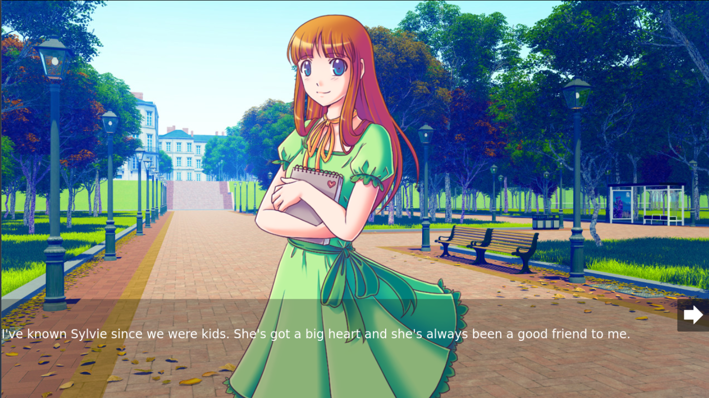

# The Question

Port of [**Ren'Py**] example project [**_The Question_**] to Godot using [**Rakugo Visual Novel Kit**]

[**Rakugo Visual Novel Kit**]: https://github.com/rakugoteam/VisualNovelKit
[**_The Question_**]: https://github.com/renpy/renpy/tree/master/the_question
[**Ren'Py**]: http://www.renpy.org/
